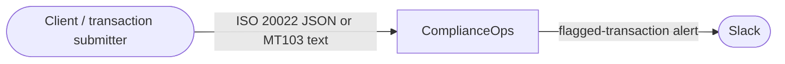
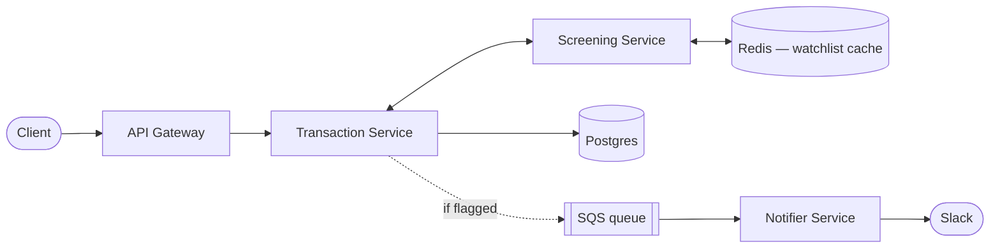
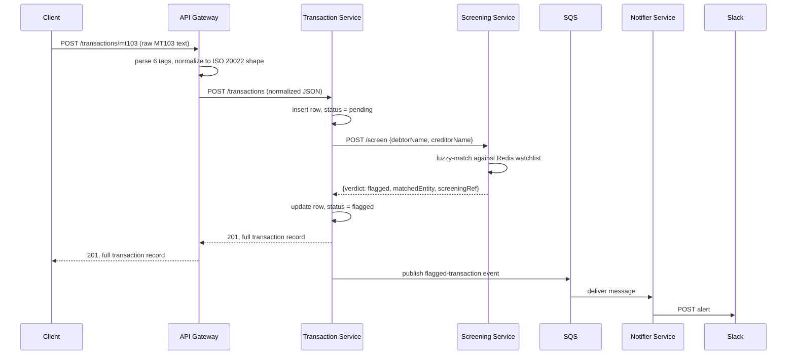
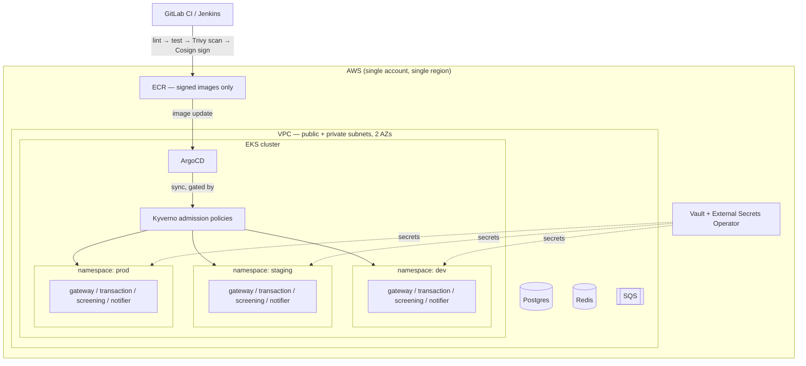

# ComplianceOps — Architecture Documentation

## 1. Introduction and Goals

### 1.1 Requirements Overview

ComplianceOps is a policy-gated Kubernetes delivery platform built around a small transaction-screening domain, modeled on sanctions-screening patterns from BFSI payment platforms.

Two requirement sets, at two layers:

- **Application layer** — accept a payment transaction (as ISO 20022-style JSON or legacy SWIFT MT103 text), screen the parties against a mock sanctions watchlist, persist the result, and alert on a match.
- **Platform layer** — provision the runtime via infrastructure-as-code, deploy every change through an auditable GitOps path, and block any deployment that violates a compliance policy before it reaches a cluster.

Note that the project does not have real BICs, no real accounts and no connection to any actual payment network or watchlist provider.

### 1.2 Quality Goals

| # | Quality goal | Motivation |
|---|---|---|
| 1 | **Auditability** | Every deployment and every flagged transaction must be traceable end to end — who/what approved it, when, and against which policy or watchlist entry. |
| 2 | **Supply-chain security** | No unscanned or unsigned container image reaches production; no credential ever sits in plaintext in a manifest, pipeline variable, or Kubernetes `Secret`. |
| 3 | **Deployment confidence** | A change that violates a policy is rejected before it reaches a cluster, not caught afterward in an incident. |
| 4 | **Operability** | The platform is observable by default and recoverable within a documented, drilled recovery time. |
| 5 | **Extensibility** | A new inbound transaction format can be added at the Gateway without any downstream service knowing it exists. |

### 1.3 Stakeholders

| Role | Concern |
|---|---|
| Compliance / risk reviewer | Correctness of screening verdicts; a complete audit trail per transaction |
| Platform / DevOps engineer | A reliable, self-service deployment path with guardrails  |
| Engineering leadership | Cost control, delivery speed, and a rehearsed incident-recovery time |
| Auditor (simulated) | Evidence that policy gates and image signing are actually enforced |

---


## 3. System Scope and Context

### 3.1 Business Context



| Neighbor | Direction | Description |
|---|---|---|
| Client | inbound | Submits a transaction as ISO 20022-style JSON, or as legacy SWIFT MT103 text |
| Slack | outbound | Receives an alert when a transaction is screened and flagged |

### 3.2 Technical Context

| Interface | Protocol / format |
|---|---|
| Client → Gateway | HTTPS, JSON (`POST /transactions`) or plain text MT103 (`POST /transactions/mt103`) |
| Gateway → Transaction Service | HTTPS, JSON (normalized ISO 20022-style shape) |
| Transaction Service → Screening Service | HTTPS, JSON |
| Transaction Service → Notifier Service | AWS SQS (async, JSON message body) |
| Notifier Service → Slack | HTTPS, Slack incoming webhook |

---

## 4. Solution Strategy

| Decision | Rationale | See |
|---|---|---|
| This is a multi-repo project with 4 independandtly deployable services | Each gets its own CI pipeline and release cadence | ADR-001 |
| ArgoCD for GitOps delivery | Git becomes the single source of truth for what's running; deployment state is diffable and auditable, not a shell history | ADR-002 |
| ISO 20022 field names as the internal schema, MT103 accepted and normalized at the edge | Mirrors the real MT→MX migration pattern the SWIFT network itself completed for cross-border payments; a genuine domain differentiator over a generic `sender/receiver` schema | ADR-003 |
| Go for the Screening Service | The one CPU/lookup-heavy service in the system; a deliberate, defensible reason for a second language, not novelty for its own sake | ADR-004 |
| Synchronous Screening call, async Notifier | A verdict is required before a transaction record is complete; a Slack alert is not — so only the alert path is decoupled onto a queue | ADR-005 |

---

## 5. Building Block View

### 5.1 Whitebox — Overall System



| Building block | Responsibility | Interface | Technology |
|---|---|---|---|
| **API Gateway** | Stateless entry point. Authenticates the caller, validates the request shape, normalizes MT103 to the internal schema, forwards to the Transaction Service. | `POST /transactions`, `POST /transactions/mt103`, `GET /transactions/{id}`, `GET /healthz` | Python · FastAPI |
| **Transaction Service** | Owns the `transaction` record. Persists it, calls Screening synchronously for a verdict, publishes to SQS if flagged. | `POST /transactions`, `GET /transactions/{id}`, `GET /transactions?status=` | Python · FastAPI, SQLAlchemy + asyncpg |
| **Screening Service** | Stateless. Fuzzy-matches a debtor/creditor name pair against a watchlist cached in Redis; returns a verdict. | `POST /screen` | Go |
| **Notifier Service** | Consumes flagged-transaction events off SQS; posts an alert to Slack. Not called synchronously by any other service. | SQS consumer; `GET /healthz` | Node.js · Express |

### 5.2 Level 2 — Internal Structure

**API Gateway**: `Auth & rate-limit` → `Request validation` (routes JSON vs. MT103) → `MT103 parser` (six-tag line parser, only on the MT103 path) → `Proxy / forward` to the Transaction Service.

**Transaction Service**: `Request handler` → `Orchestration` (calls Screening, decides `clear`/`flagged`, publishes to SQS when flagged) → `Repository` (SQLAlchemy) → Postgres.

**Screening Service**: `Request handler` → `Fuzzy match engine` → `Cache client` → Redis (watchlist loaded at startup from a seed `watchlist.json`).

**Notifier Service**: `SQS poller` → `Message parser` → `Webhook dispatcher` → Slack.

---

## 6. Runtime View

### Scenario: a flagged transaction, submitted as MT103



1. The client posts raw MT103 text to the Gateway.
2. The Gateway's parser reads the six supported tags (`:20:`, `:32A:`, `:50K:`, `:52A:`, `:59:`, `:57A:`, `:70:`) and builds the same JSON shape a native ISO 20022 client would have sent.
3. The Transaction Service never knows which format the client originally used — it only ever sees the normalized shape.
4. The Screening call is synchronous: the client's request doesn't complete until a verdict exists.
5. The Slack alert is asynchronous: it happens after the client already has its response, off an SQS queue, so a slow webhook never adds latency to the transaction path.

---

## 7. Deployment View



| Concern | Implementation |
|---|---|
| Infrastructure provisioning | Terraform — VPC module (public/private subnets, 2 AZs), EKS module + managed node group, one ECR repo per service, IAM roles via IRSA |
| Continuous integration | Dual pipelines (GitLab CI and Jenkins, one per service repo): lint → test → build → Trivy scan → Cosign sign → push to ECR |
| Continuous deployment | ArgoCD Applications per service per environment; image-update automation triggers a sync on a new signed image — no manual `kubectl apply` |
| Environments | `dev`, `staging`, `prod` namespaces on one cluster, parameterized Helm charts / Kustomize overlays per environment |
| Policy enforcement | Kyverno admission policies (15+): no root containers, mandatory resource limits, images from ECR only, owner/team labels required |
| Secrets | Vault + External Secrets Operator; no credential lives in a plaintext Kubernetes `Secret` or pipeline variable |
| Observability | kube-prometheus-stack + Loki; a Grafana dashboard for policy pass/fail rate, deployment frequency, and an audited-deployments table |
| Cost visibility | Infracost wired into the Terraform pipeline, surfacing cost delta on every PR |

---

## 8. Crosscutting Concepts

### 8.1 Data model — `transaction`

Owned by the Transaction Service. Money is always a **string**, never a float.

| Field | Type | Notes |
|---|---|---|
| `id` | UUID | generated by the Transaction Service |
| `endToEndId` | string | client-supplied reference; from MT103 tag `:20:` |
| `debtor.name` | string | payer name; from MT103 tag `:50K:` |
| `debtorAgent.bic` | string, nullable | payer's bank BIC (8 or 11 chars); from MT103 tag `:52A:` |
| `creditor.name` | string | payee name; from MT103 tag `:59:` |
| `creditorAgent.bic` | string, nullable | payee's bank BIC; from MT103 tag `:57A:` |
| `instructedAmount.amount` | string, 2 decimal places | e.g. `"1000.00"`; from MT103 tag `:32A:` |
| `instructedAmount.currency` | string, 3-letter ISO 4217 | e.g. `"USD"`; also from `:32A:` |
| `remittanceInformation` | string, nullable | free-text payment purpose; from MT103 tag `:70:` |
| `status` | enum: `pending` \| `clear` \| `flagged` | set after the Screening call returns |
| `screeningRef` | string, nullable | reference returned by the Screening Service |
| `createdAt` | timestamp (UTC) | set on insert |

### 8.2 MT103 parsing scope — deliberately a subset

Real MT103 messages carry 20+ conditionally-present fields; full SWIFT compliance isn't the point of this project. The Gateway's parser handles exactly six tags — enough to prove the normalization pattern, not the whole spec. A single-pass parser matching each line against `^:([0-9]{2}[A-Z]?):(.*)$` and switching on the tag is sufficient; no heavyweight MT-parsing library is needed.

### 8.3 Shared conventions

- **Errors**: every service returns `{ "error": "<snake_case_code>", "message": "<human-readable>" }` on 4xx/5xx.
- **Timestamps**: UTC, ISO 8601, always.
- **Money**: always a string with 2 decimal places, never a JSON number.
- **BICs**: 8 or 11 uppercase alphanumeric characters — shape is validated, not checked against a real BIC directory.
- **IDs**: UUIDs for `transaction.id`; `endToEndId` and `screeningRef` are opaque, unique strings, not necessarily UUIDs.

### 8.4 Security

Non-root containers, mandatory resource limits, and images-from-ECR-only are enforced by Kyverno at admission time, not by convention. Every image is Trivy-scanned and Cosign-signed in CI; Cosign signature verification is re-checked at admission. Every credential lives in Vault, synced into the cluster by External Secrets Operator.

### 8.5 Testing strategy

- Unit tests per service (business logic, not the framework).
- Policy tests: a deliberately non-compliant manifest is pushed and Kyverno's rejection is captured as evidence.
- A local integration script (bash + curl, or Python) posts one clear and one watchlist-matching transaction end to end and asserts on `status`, the SQS message, and the Notifier's log line.
- A `k6` script generates steady low-concurrency traffic against `POST /transactions` so the Grafana dashboard reflects a running system, not an empty graph.
- A disaster-recovery drill (etcd backup/restore, simulated node failure) produces a real, timed recovery number instead of an estimate.

---

## 9. Architecture Decisions

### ADR-001: Polyrepo over monorepo

- **Status**: Accepted
- **Context**: Four independently deployable services need their own CI pipeline, release cadence, and access control; they also need to stay easy to locate as one project.
- **Decision**: Split into five repos — a `complianceops` hub (infra, GitOps manifests, policies, docs) plus one repo per service — tied together with a shared GitHub topic tag and pinned on the profile.
- **Consequences**: Each service's pipeline and history stay clean and independent. Cost: cross-service changes touch multiple PRs, and the hub repo has to be the explicit source of truth for how the pieces fit together.

### ADR-002: ArgoCD for GitOps delivery

- **Status**: Accepted
- **Context**: Deployment state needs to be diffable, auditable, and reproducible from Git — not the result of an ad hoc `kubectl apply` history.
- **Decision**: Adopt ArgoCD; Git becomes the single source of truth for what's running in each environment, synced automatically and gated by Kyverno.
- **Consequences**: A deployment's entire history is `git log`. A failed sync is a first-class, visible state, not a silent drift. Cost: another moving part to run and to learn.

### ADR-003: ISO 20022 field names as the internal schema, with MT103 accepted and normalized at the edge

- **Status**: Accepted
- **Context**: A generic `sender/receiver/amount` schema would work, but wouldn't reflect how real payment systems are actually shaped or the MT→MX migration the industry is mid-way through.
- **Decision**: Model the `transaction` record on ISO 20022 (pacs.008) field names. The Gateway additionally accepts legacy MT103 text and normalizes it to the same shape, so every downstream service only ever handles one format.
- **Consequences**: The domain model reads as realistic payments engineering, not a toy CRUD schema — a genuine BFSI differentiator. Cost: the Gateway owns a small parsing responsibility instead of being pure pass-through.

### ADR-004: Go for the Screening Service

- **Status**: Accepted
- **Context**: Three services could reasonably be built in one language; a single-language project is a weaker signal of range.
- **Decision**: Build Screening — the one CPU/lookup-heavy service (fuzzy matching against a cached watchlist) — in Go.
- **Consequences**: A defensible, non-arbitrary reason for polyglot services. Cost: one more toolchain and CI pipeline shape to maintain.

### ADR-005: Synchronous Screening call, asynchronous Notifier

- **Status**: Accepted
- **Context**: A transaction record isn't meaningfully complete without a verdict; a Slack alert has no such requirement.
- **Decision**: The Transaction Service calls Screening synchronously and blocks on the response. It publishes to SQS (consumed by the Notifier) only when the verdict is `flagged`.
- **Consequences**: The client always gets a final `status` in the response. A slow or failing webhook can never add latency or risk to the transaction path.

---

## 10. Quality Requirements

### 10.1 Quality Tree

```
Quality
├── Security
│   ├── Supply-chain integrity (scanned + signed images only)
│   └── Secrets never in plaintext
├── Auditability
│   ├── Every deployment traceable to a Git commit
│   └── Every flagged transaction traceable to a watchlist entry
├── Operability
│   ├── Observable by default (metrics, logs, dashboard)
│   └── Recoverable within a documented RTO
└── Extensibility
    └── New inbound transaction formats addable at the edge only
```

### 10.2 Quality Scenarios

| # | Scenario | Stimulus | Response | Measure |
|---|---|---|---|---|
| 1 | Non-compliant manifest pushed to GitOps | A manifest with a root container or missing resource limits reaches ArgoCD | Kyverno rejects it at admission; ArgoCD shows the sync as failed | Rejection is visible within one sync cycle, no manual intervention |
| 2 | Unsigned image reaches the cluster | An image without a valid Cosign signature is deployed | Admission blocks it | 100% of unsigned images blocked |
| 3 | Node failure | A node is force-deleted mid-operation | Workloads reschedule; recovery is timed | Documented RTO from an actual drill, not an estimate |
| 4 | Transaction matches the watchlist | A debtor or creditor name matches a seeded watchlist entry | `status = flagged`, an SQS message is published, Slack receives an alert | End-to-end round trip completes and is verifiable in the integration test |

---

## 11. Risks and Technical Debt

| Risk / debt | Detail |
|---|---|
| MT103 parser is a deliberate subset | Only six tags are handled; a real MT103 message can carry 20+ conditionally-present fields. Not a gap for this project's scope, but not a drop-in production parser either. |
| No real BIC directory validation | BICs are checked for shape (8/11 alphanumeric chars) only, never resolved against an actual SWIFT BIC directory. |
| Watchlist is a toy dataset | `watchlist.json` is a small, seeded, mock list — not a production sanctions-list feed (e.g. no live OFAC integration). |
| Single region, no cross-region DR | Recovery drills cover node failure and etcd restore, not a full regional outage. |
| Vault runs in dev mode | Sufficient to demonstrate the External Secrets Operator pattern; not a hardened, unsealed-with-Shamir-keys production Vault setup. |
| Cost-driven teardown | Infrastructure is destroyed between build sessions, so this environment does not run continuously the way a real production platform would. |

---

## 12. Glossary

| Term | Definition |
|---|---|
| **BIC** | Business Identifier Code — SWIFT's bank/institution identifier, 8 or 11 characters |
| **ISO 20022 / pacs.008** | The modern, structured message standard for payments; `pacs.008` is its customer-credit-transfer message type |
| **MT103** | The legacy SWIFT message type for a single customer credit transfer; colon-tagged flat text |
| **MT→MX** | Industry shorthand for migrating legacy MT-format SWIFT messages to modern ISO 20022 (MX) messages |
| **GitOps** | Deployment model where the desired state of a system is declared in Git and an operator (ArgoCD) reconciles the cluster to match it |
| **Admission policy** | A rule (via Kyverno) evaluated when a resource is submitted to the Kubernetes API, before it's persisted |
| **IRSA** | IAM Roles for Service Accounts — lets an EKS pod assume an AWS IAM role without static credentials |
| **RTO** | Recovery Time Objective — the target time to restore service after a failure |
| **endToEndId** | Client-supplied transaction reference carried unchanged from submission to completion |
